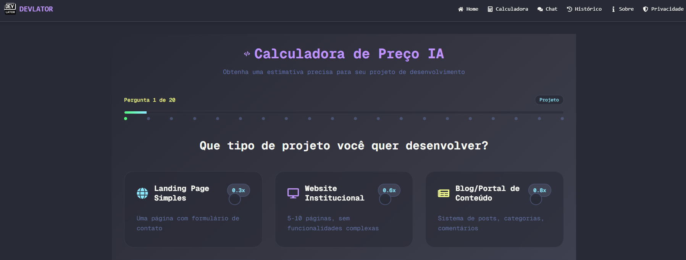

# Devlator - Calculadora para DEVs

Devlator é uma aplicação profissional desenvolvida com Next.js, projetada para facilitar estimativas de projetos de software. Com uma interface inspirada em IDEs modernas, utiliza conceitos de glassmorphism, animações suaves e transições elegantes para proporcionar uma experiência única para desenvolvedores.



## ✨ Funcionalidades

- **Quiz interativo** para estimativas rápidas e precisas de projetos
- **Tabela de resultados** detalhada e fácil de interpretar
- **Chatbot Devinho** integrado (baseado na GeminiAPI) para tirar dúvidas técnicas
- **Persistência local** dos dados do usuário (localStorage)
- **UI moderna** com Tailwind CSS e design responsivo
- **SEO otimizado** para melhor indexação
- **Imagens ilustrativas públicas** e ícones vetoriais (sem emojis)
- **Componentização**: estrutura modular e reutilizável
- **Acessibilidade**: navegação por teclado e contraste aprimorado

## 🚀 Tecnologias Utilizadas

- [Next.js](https://nextjs.org/)
- [React](https://react.dev/)
- [Tailwind CSS](https://tailwindcss.com/)
- [GeminiAPI](https://ai.google.dev/)
- [TypeScript](https://www.typescriptlang.org/)
- [ESLint](https://eslint.org/)

## 📦 Scripts Disponíveis

- `npm run dev` — Inicia o servidor de desenvolvimento
- `npm run build` — Gera a build de produção
- `npm run start` — Inicia o servidor em produção
- `npm run lint` — Executa o linter

## 🛠️ Como rodar localmente

1. Clone o repositório:
    ```bash
    git clone https://github.com/seu-usuario/devlator.git
    cd devlator
    ```
2. Instale as dependências:
    ```bash
    npm install
    ```
3. Inicie o servidor de desenvolvimento:
    ```bash
    npm run dev
    ```
4. Acesse [http://localhost:3000](http://localhost:3000) no seu navegador.

## 📁 Estrutura do Projeto

```
devlator/
├── public/
│   └── devlator-preview.png
├── src/
│   ├── components/
│   ├── pages/
│   ├── styles/
│   └── utils/
├── package.json
└── README.md
```

## 🤝 Contribuição

Contribuições são bem-vindas! Sinta-se à vontade para abrir issues ou enviar pull requests.

## 📄 Licença

Este projeto está licenciado sob a [MIT License](LICENSE).

---

Projeto iniciado com [`create-next-app`](https://nextjs.org/docs/app/api-reference/cli/create-next-app).
