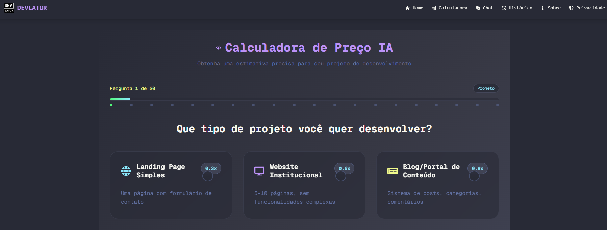

# Devlator — calculadora de preço de projetos para devs

Descubra quanto cobrar por um site, app, e-commerce, API ou sistema. O Devlator estima **horas, valor-hora, prazo e impostos** e compara o resultado com a **média do mercado brasileiro**.



## Funcionalidades

- **Calculadora de projeto**: questionário adaptativo (as perguntas mudam conforme o tipo de projeto), com o impacto de cada resposta visível (`+16h`, `+20%`…).
- **Comparação com o mercado**: seu preço e seu valor-hora posicionados nas faixas praticadas por freelancers e agências.
- **Simulador "E se eu cobrar…"**: mude valor-hora, senioridade, região e impostos e veja o preço recalcular na hora.
- **Prazo realista**: semanas calculadas pela equipe e dedicação, com alerta quando o prazo do cliente não fecha.
- **Calculadora de valor-hora** (`/valor-hora`): a partir da renda desejada, custos, impostos, férias e 13º.
- **Proposta em PDF ou texto**, com escopo, fases, manutenção e condições de pagamento.
- **Chat com IA (Devinho)**: recebe a estimativa como contexto e aceita imagem do design, site de referência, documentos e região.
- **Tudo salvo localmente**: perfil, rascunho em andamento, histórico de estimativas (com comparação, exportação e importação) e conversas.
- **Favicon animado** enquanto calcula ou enquanto a IA responde.
- **SEO**: metadata por página, Open Graph gerado, sitemap, robots, manifest, JSON-LD (WebApplication, FAQ, HowTo).

## Como o preço é calculado

```
preço = (horas-base × escopo + horas fixas) × (1 + ajustes) × (1 + coordenação)
        × valor-hora × (1 + urgência) × (1 + contingência) ÷ (1 − impostos)
```

O cálculo é determinístico e roda no navegador ([src/lib/estimator.ts](src/lib/estimator.ts)). A IA não define o número: só comenta, sugere e aponta riscos.
As referências de mercado e as fontes ficam em [src/lib/market-data.ts](src/lib/market-data.ts) e são exibidas em `/sobre`.

## Rodando localmente

```bash
npm install
cp .env.example .env.local   # opcional: coloque sua GEMINI_API_KEY
npm run dev
```

Acesse http://localhost:3000. Sem `GEMINI_API_KEY` a calculadora funciona normalmente; só o chat fica indisponível.

| Variável | Uso |
| --- | --- |
| `GEMINI_API_KEY` | Análise e chat com IA (opcional) |
| `GEMINI_MODEL` | Modelo do Gemini (padrão `gemini-2.5-flash`) |
| `NEXT_PUBLIC_SITE_URL` | URL pública para canonical, sitemap e Open Graph |

## Estrutura

```
src/
├── app/                 # rotas (App Router), APIs, sitemap, robots, OG image
│   └── api/             # analysis, chat, location, webscrape
├── components/
│   └── calculator/      # passos da calculadora e tela de resultado
└── lib/
    ├── market-data.ts   # faixas de mercado, valor-hora, regiões, fontes
    ├── questions.ts     # perguntas e o efeito de cada resposta
    ├── estimator.ts     # motor de cálculo
    ├── storage.ts       # persistência local
    └── useAnimatedFavicon.ts
```

## Stack

Next.js 15 · React 19 · Tailwind CSS 4 · TypeScript · Google Gemini · jsPDF

## Licença

MIT
